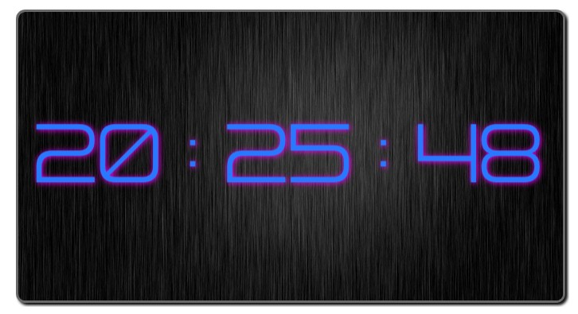
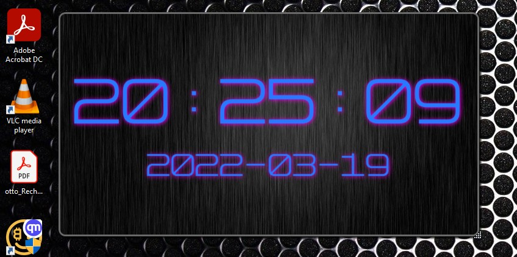
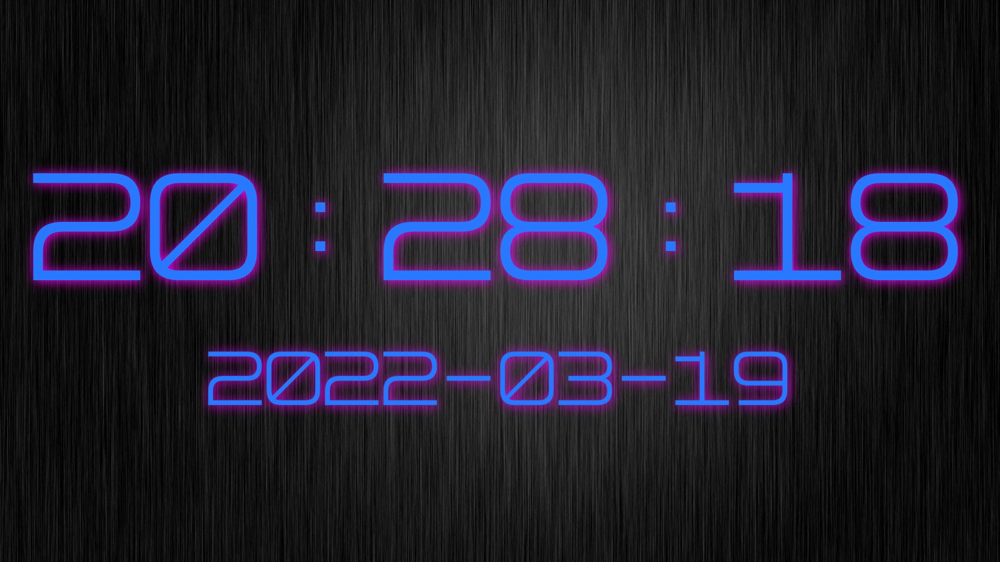
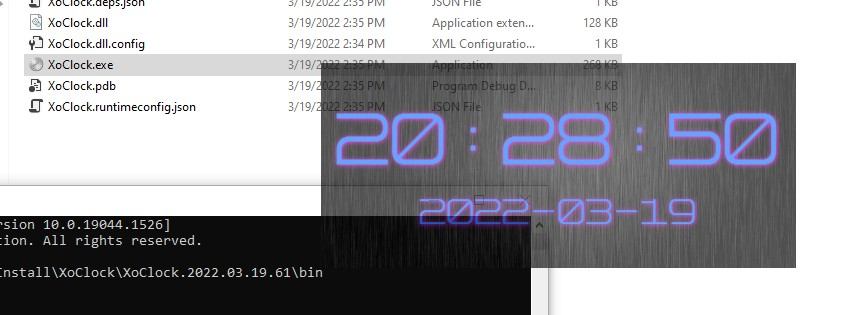
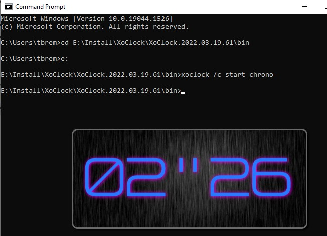

XoClock: Clock/Chrono Destkop App

Switch between Clock/Chronometer with double click.

Keyboard commands described on *UserGuide.txt*

Double instance control via command line: *Refer to UserGuide.txt*

# Demo
Time Mode

Style with shadow:

Chronometer Mode:

Chronometer after 1 minute:

Resizable:

Full Screen with F1:

With opacity changed with scroll of the mouse:

Controlable via command line:

