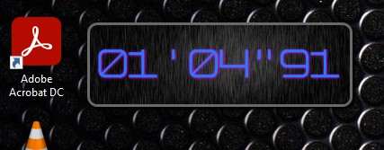

XoClock Destkop Clock

Keyboard commands on UserGuide.txt
Chronometer mode available with double click

# Demo

Time Mode

Chronometer Mode:

Resized:

With opacity changed with scroll of the mouse:

